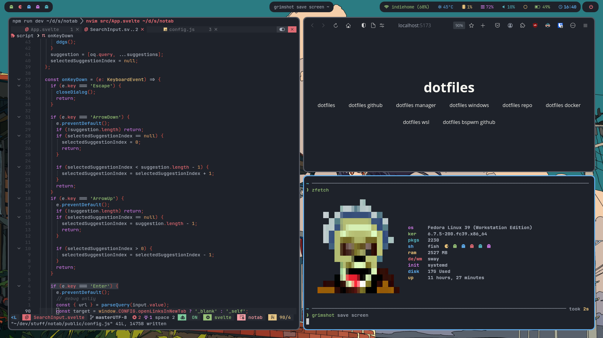

## dotfiles
 
my personal dotfiles

## info
|Distro|[Fedora](https://fedoraproject.org/)|
|:---:|:---:|
|WM|[hyprland](https://hyprland.org/)|
|Bar|[waybar](https://github.com/Alexays/Waybar)|
|Launcher|[fuzzel](https://codeberg.org/dnkl/fuzzel)|
|Terminal|[kitty](https://github.com/kovidgoyal/kitty)|
|Shell|[fish](https://github.com/fish-shell/fish-shell)|
|Prompt|[starship](https://github.com/starship/starship)|


## NOTE for fish
I use fish with [fisher](https://github.com/jorgebucaran/fisher)  so first you need to install [fisher](https://github.com/jorgebucaran/fisher)  with
```sh
curl -sL https://raw.githubusercontent.com/jorgebucaran/fisher/main/functions/fisher.fish | source && fisher install jorgebucaran/fisher
```
> the installation may change in future, so make sure check the [fisher](https://github.com/jorgebucaran/fisher)  repo first

and don't forget to install esential programs to make fish more elegan
- eza
- zoxide
- fzf

## colorscheme
[flavours](url) is tool i use for generate colorscheme based from 16 color defined, or called base-16.
All colorscheme file is generated to `~/.cache/flavours`. The method i use to integrate to my config is link it or include it to config file.
Install flavours require rust, so if you don't want to install rust, you can stow the `colorscheme` module, because inside it is pre-generated color file.

## fonts
- Geist
- GeistMono NF
- JetBrainsMono NF


## other programs
just install gnome bro, it's not that bloat bruh
